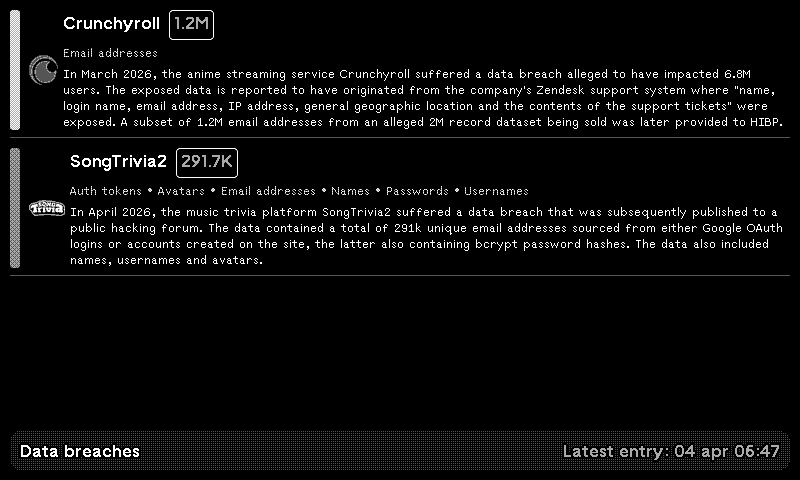

# trmnl-databreaches.plugin

<!-- PLUGIN_STATS_START -->
## 🚀 TRMNL Plugin(s)

*Last updated: 2025-12-03 06:36:52 UTC*

##  [Data Breaches](https://usetrmnl.com/recipes/183668)

### Description
Keep up to date with the latest data breaches using <a href='https://haveibeenpwned.com'>haveibeenpwned.com</a> as datasource. A hourly running github action retrieves the latest breaches from haveibeenpwned and stores the 30 latest ones to avoid sending over too much data.

### 📊 Statistics

| Metric | Value |
|--------|-------|
| Installs | 22 |
| Forks | 2 |

---

<!-- PLUGIN_STATS_END -->