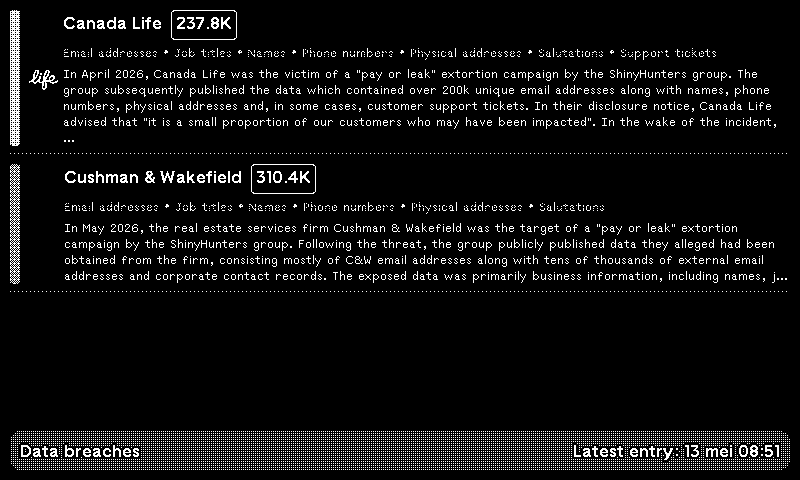

# trmnl-databreaches.plugin

<!-- PLUGIN_STATS_START -->
## 🚀 TRMNL Plugin(s)

*Last updated: 2026-03-20 07:01:04 UTC*

##  [Data Breaches](https://usetrmnl.com/recipes/183668)

### Description
Keep up to date with the latest data breaches using <a href='https://haveibeenpwned.com'>haveibeenpwned.com</a> as datasource.

### 📊 Statistics

| Metric | Value |
|--------|-------|
| Installs | 47 |
| Forks | 2 |

---

<!-- PLUGIN_STATS_END -->